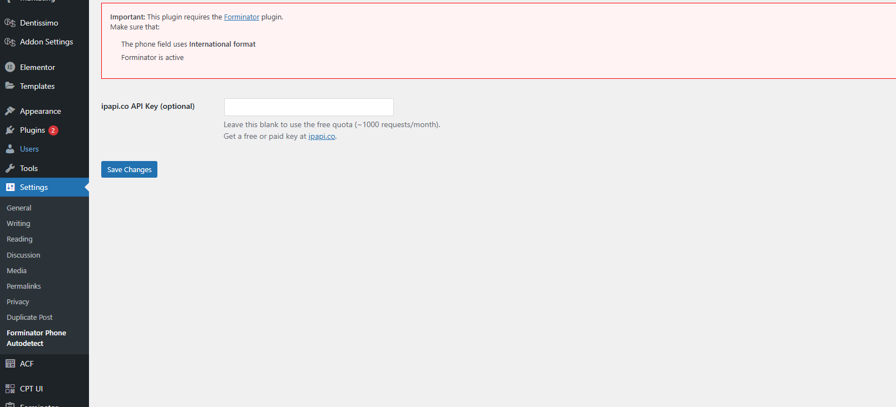

# Forminator Phone Country Autodetect

**Author:** [Huseyin Mardinli](https://github.com/Housma)  
**Donate:** [https://www.paypal.com/donate/?hosted_button_id=MDDGA8HUZA4B4](https://www.paypal.com/donate/?hosted_button_id=MDDGA8HUZA4B4)

Automatically sets the international country calling code in Forminator's phone field using the visitor's IP address. Supports [ipapi.co](https://ipapi.co) with optional API key.

---

## 🌍 Features

- Works with Forminator phone fields
- Automatically detects country calling code (`+44`, `+33`, etc.)
- Admin settings page to enter your own API key
- Clean, lightweight code

---

## 🧰 Requirements

- WordPress 5.0+
- PHP 7.2+
- [Forminator plugin](https://wordpress.org/plugins/forminator/)

---

## 🚀 Installation

1. Download or clone this repo
2. Upload the folder to `/wp-content/plugins/`
3. Activate the plugin via WordPress admin
4. Go to **Settings > Forminator Phone Autodetect** to add your ipapi.co API key (optional)

---

## 📸 Screenshots

- Admin settings with API key field
- Auto-filled phone field in Forminator with country code

---

## 🙏 Support & Contributions

If you find this plugin helpful, consider [donating here](https://www.paypal.com/donate/?hosted_button_id=MDDGA8HUZA4B4) 💙

Pull requests and improvements are welcome!

---

## 📄 License

GPLv2 or later
